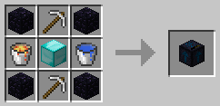
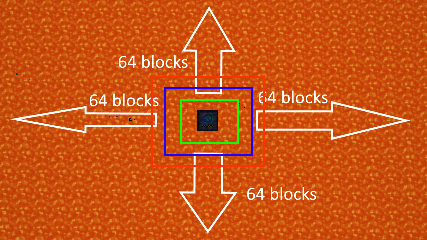

= Pump
:icon: pump.png

Ranged Pumps is a simple mod that adds a pump that pumps liquids in a range.

The {doctitle} is the only block that is added by Ranged Pumps.
It pumps liquids in a range.

== Placement

Place the {doctitle} down, and it'll only work *without* a redstone signal.

== Redstone signal

If you give the {doctitle} a redstone signal, it will stop working until you disable the redstone signal.

== Energy requirements

By default, the {doctitle} requires Forge Energy, but can be configured to not use energy in the config.

== Internal tank

The size of the internal tank of the {doctitle} is 32 buckets (by default).
You can increase or decrease this in the config.

The {doctitle} will stop running if the internal tank is full.

== Status updates

Right-click on the {doctitle} to know what it is doing and to know if it is running.

== Scanning and range

It'll start pumping liquids in rectangular spiral shape 1 block under the {doctitle.

The default range is 64 blocks.
That'll mean it scan 64 blocks in any direction, nearest-first.

On a vertical (Y) level, it will scan liquids from the {doctitle} to bedrock.

== Liquids to stone

The {doctitle} will also replace any liquids to stone by default.
This can be turned off in the config.

== Auto-pushing liquids

The {doctitle} will auto-push liquids to neighboring tanks.
You can also get the liquids out with pipes.

== Chunkloading

The mod doesn't chunkload the {doctitle} automatically.
You'll need another mod to get this behavior.