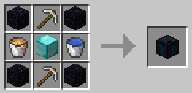
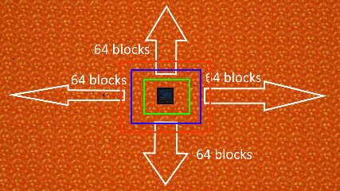

= Pump
:icon: pump.png

Ranged Pumps adds a simple pump that extracts liquids within a configurable range.

The {doctitle} is the only block added by the mod.

== Usage

Place the {doctitle}. It operates *only without* a redstone signal.

== Redstone

A redstone signal disables the {doctitle} until removed.

== Energy

Uses Forge Energy by default (configurable to disable energy usage).

== Internal tank

Holds 32 buckets by default (configurable). Stops when full.

== Status

Right-click the {doctitle} to view its current status.

== Range & scanning

Pumps in a rectangular spiral, 1 block below the {doctitle}.
Scans up to 64 blocks in all horizontal directions (nearest-first), and from the {doctitle}'s Y level down to bedrock.

== Liquid replacement

Replaces pumped liquids with stone (can be disabled via config).

== Output

Auto-pushes liquids to adjacent tanks. Pipes also work.

== Chunkloading

The {doctitle} is *not* chunkloaded. Use another mod for that.
