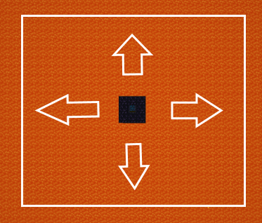
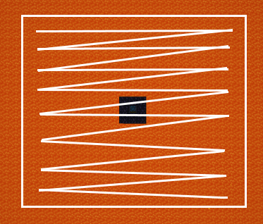

= Pump
:icon: pump.png

[.alert.alert-warning]
****
This documentation page refers to the **Minecraft 1.10.2** version of Ranged Pumps.
Consult the xref:index.adoc[latest version of the documentation].
****

The {doctitle} is the only block that is added by Ranged Pumps.
It pumps liquids in a range.

image::../assets/recipe.png[The crafting recipe of the pump]

== Placement

Place the {doctitle} down, apply a redstone signal, and it'll work.

== Energy requirements

By default, the {doctitle} requires no energy, but the {doctitle} can be configured to use RF energy in the config.

== Internal tank

The size of the internal tank of the {doctitle} is by default 32 buckets, you can increase or decrease this in the config.

The {doctitle} will stop running if the internal tank is full.

== Status updates

Right-click on the {doctitle} to know what it is doing and if it is running.

== Scanning and range

It'll pump liquids in a rectangular area 1 block under the {doctitle}, the size of this rectangular area can be specified in the config.

The default range specified in the config is 128 blocks.
That means it will search 64 blocks in any direction of the {doctitle}.

This is how it will scan for liquids (from the top left to the bottom right):

== Liquids to stone

The {doctitle} will also replace any liquids to stone by default.
This can be turned off in the config.

== Auto-pushing liquids

The {doctitle} doesn't auto-push liquids.
You have to suck them out manually with an external mod that can do that, for example pipes.

Make sure you're not disabling the pipe with the redstone signal that you're providing to the pump!

== Chunkloading

The mod doesn't chunkload the {doctitle} automatically.
You'll need another mod to get this behavior.